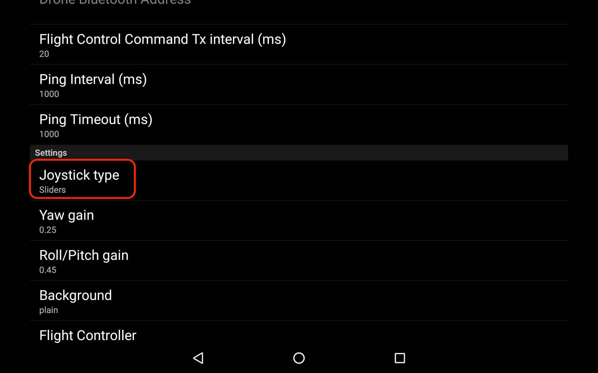

This section documents the control of the Snapdragon Flight<sup>TM</sup> with a DroneController android application.

# Table of contents
1. [Starting DroneController Application](#starting-dronecontroller-application)
  * [Connecting to UAV](#connecting-to-uav)
  * [Joystick Controls](#joystick-controls)
  * [Flying UAV](#flying-uav)
1. [FPV Stream on DroneController Application](#fpv-stream-on-dronecontroller-application)


# Starting DroneController Application


## Connecting to UAV
1. On the Android device, go to the application launch screen and open the DroneController application


  1. After DroneController launches, the initial screen prompts Waiting for SSID. The message then changes to Wi-Fi Scanning. This message remains until the application connects successfully to the UAV application.
    
    1. When communication is established between DroneController and the UAV, the status message changes to Connected to "(name of drone AP) - rssi". Note that if the drone is in Station mode, the name of the Wi-Fi that both the drone and the tablet are connected to is displayed. In station mode, the DroneController application needs the IP address of the Drone to connect. In that case, go to the Settings and input the IP address of the drone.
    
    NOTE: In the case of SoftAP mode, the Drone's IP address is know to the DroneController application, as it acts as the gateway.


## Joystick Controls
  1. There are several options for the type of joysticks available.
    1. Sliders: Two separate sliding joystick controls.
    1. CrossStick: Two sliding joystick controls mounted on lines in the shape of a cross.
    1. Full Joystick: The left joystick matches the right joystick.
  1. To change the joystick controls, do the following:
    1. Go "Setting" menu option

  

    1. Select "Joystick type"



    1. Select your preferred choice.


## Flying UAV

1. To arm the UAV,  press "ARM" 
  1. To manually arm a drone running PX4, hold the joystick in the lower right corner. Yaw gain must be set to 1f for this maneuver to be successful.


    **NOTE**: No indication is provided on the application when the UAV is armed. Check the UAV to verify.

    **NOTE**: The application provides virtual joysticks to control roll, pitch, yaw, and thrust. The left stick controls the thrust and yaw. The right stick controls the pitch and roll. Scaled means the normalized values for roll, pitch, yaw, and thrust.


1. Changing Flight Mode

    The DroneController application allows to set the PX4 flight stack in "Altitude Control Mode"(ATLCTL) or "MANUAL" mode.  To Select the mode, click the desired mode in the main screen.


# FPV Stream on DroneController Application
  The DroneController android application can receive the FPV stream from the UAV.  To enable this, do the following:
  1. Start the RTSP server on the Snapdragon Flight<sup>TM</sup>( ie on the target )
 
  ```
  %>adb shell 
  %>qcamvid –c hires –f auto –o /dev/null –t 600
  ```

  **NOTE**: This assumes that you have  adb connection to the Snapdragon Flight<sup>TM</sup>.  You can run the same command via ssh.  When using ssh, make sure to run the above command as root.

  Here is a brief description of the arguments passed to qcamvid

    ```
    “-t” is the video stream duration in seconds (the video stream will stop after that length of time, which will cause the FPV on the application to fail since there is no more video streaming).
    "-c" is the type of camera.
    "-f" is the focus mode. The example command above sets it in Auto mode.
    "-o" is video output file name. The example command above does not keep the video file, and instead pipes it to /dev/null.
    ```

  **NOTE**: For more information on these options, run the following command:

  ```
  %>qcamvid --help
  ```

  1. Enable FPV stream on DroneController application( tablet application )
    1. Go to Menu --> "Settings"
    1. Select "Background"


    1. Select "fpv stream"


